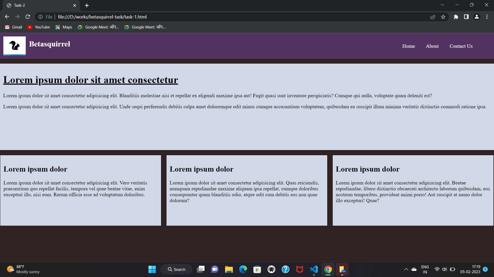
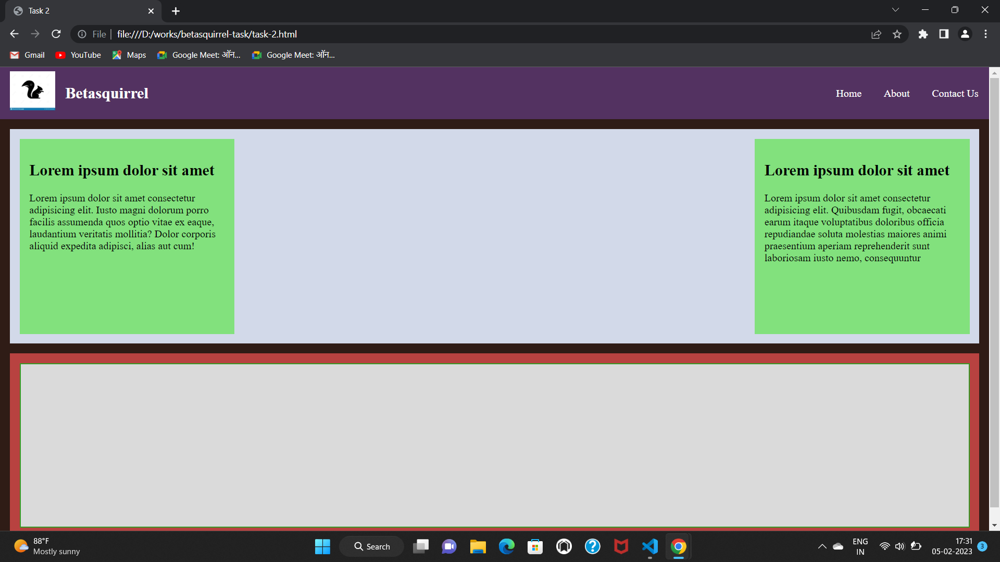
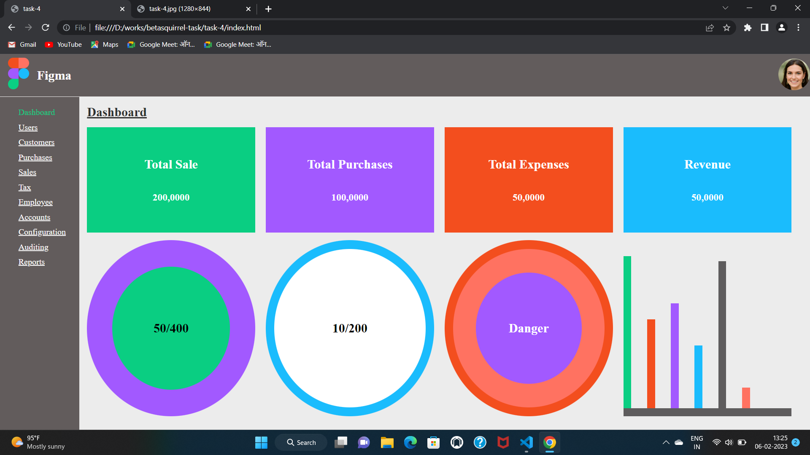

# betasquirrel-task

Assignments from betasquirrel
 
 ## first task

### formatting

**Lorem ipsum dolor sit amet consectetur** adipisicing elit. Blanditiis molestiae nisi et repellat ex eligendi maxime ipsa aut! Fugit quasi sunt inventore perspiciatis? Cumque qui nulla, voluptate quam deleniti est orem ipsum dolor sit amet *consectetur adipisicing elit.* Blanditiis molestiae nisi et repellat ex eligendi maxime ipsa aut! Fugit quasi sunt inventore perspiciatis? Cumque qui nulla, ~~voluptate quam deleniti est~~

## Linux Commands

- `cd` - Change current directory. Ex: `cd Desktop`, `cd ..`
- `ls` - LIst contents of directory. Ex:  `ls -a`  lists hidden files as well.
- `pwd` - Display current working directory path.
- `cat` - Display contets of file. Ex: `cat README.md`

## Git Commands

1. `git config` Configure git user. Ex: `git config --global user.name "saifunnisakk"`, `git config --global user.email "saifunnisakk313@gmail.com`
2. `git clone` Clone a remote git repo to your local. Ex: `git clone  https://github.com/Saifunnisakk/betasquirrel-task.git`,  `git clone https://github.com/Saifunnisakk/betasquirrel-task.git new-folder`
3. `git add` Add your file changes to git. Ex: `git add .`, `git add README.md`
4.`git commit` Commit changes to git. EX: `git commit -m "initial commit"`
5. `git push` Push your local commits to remote repo. Ex: `git push origin main`  
6. `git pull`  Fetches and downloads contents from the remote repository and integrates changes into the local repository. Ex: `git pull <remote>`

## Task 3

Read the below pages and attend the tests

- [HTML Home](https://www.w3schools.com/html/default.asp)
- [HTML Introduction](https://www.w3schools.com/html/html_intro.asp)
- [HTML Editors](https://www.w3schools.com/html/html_editors.asp)
- [HTML Basics](https://www.w3schools.com/html/html_basic.asp)
- [Elements](https://www.w3schools.com/html/html_elements.asp)
- [Attribute](https://www.w3schools.com/html/html_attributes.asp)
- [Headings](https://www.w3schools.com/html/html_headings.asp)
- [Paragraphs](https://www.w3schools.com/html/html_paragraphs.asp)
- [Styles](https://www.w3schools.com/html/html_styles.asp)
- [Formatting](https://www.w3schools.com/html/html_formatting.asp)
- [Quotations](https://www.w3schools.com/html/html_quotation_elements.asp)
- [Comments](https://www.w3schools.com/html/html_comments.asp)
- [Colors](https://www.w3schools.com/html/html_colors.asp)
- [Css](https://www.w3schools.com/html/html_css.asp)
- [Links](https://www.w3schools.com/html/html_links.asp)
- [Images](https://www.w3schools.com/html/html_images.asp)
- [Favicon](https://www.w3schools.com/html/html_favicon.asp)
- [Tables](https://www.w3schools.com/html/html_tables.asp)
- [Classes](https://www.w3schools.com/html/html_classes.asp)
- [Id](https://www.w3schools.com/html/html_id.asp)

## Tasks

| Requirement                                               | Output                                |
| ----------------------------------------------------------|---------------------------------------|
|                                |   |
|                                |   |
|                                |   |